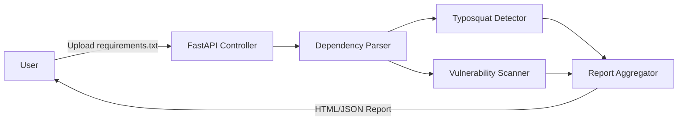

# Supply Chain Attack Simulator (Minor Project)

A **FastAPI-based** tool that demonstrates **software supply chain risks** with three modules:
1. **Typosquatting Detector** — finds suspicious dependency names (e.g., `requsets` vs `requests`).
2. **Dependency Vulnerability Scanner** — matches dependencies against a small offline mock CVE database.
3. **Malicious Package Install Simulator** — safe demo package that prints a message when "installed" to show how setup hooks can run.

---

## 🚀 Quick Start

```bash
python -m venv .venv
source .venv/bin/activate   # Windows: .venv\Scripts\activate
pip install -r requirements.txt
uvicorn app.main:app --reload
```

Open: http://127.0.0.1:8000

---

## 🧪 Try with Sample Files

Upload either of these on the home page:
- `sample_projects/requirements_good.txt`
- `sample_projects/requirements_bad.txt`

Or run the **CLI**:

```bash
python cli.py sample_projects/requirements_bad.txt
```

---

## 📦 Malicious Demo Package (Safe)

Check: `app/simulator/malicious_demo_pkg/`
This is a **safe** demonstration. If you run `pip install .` inside that folder,
`setup.py` will simply print a demo message to simulate a supply-chain attack via install hooks.
**Do not publish this package. It is for demonstration in a local environment only.**

```bash
cd app/simulator/malicious_demo_pkg
pip install .
```

---

## 🧠 Architecture

- **Frontend**: Jinja2 templates
- **Backend**: FastAPI
- **Core**: `app/scanners/` modules
- **No database**: Results are computed on the fly.
- **Conceptual ERD** (Mermaid):

```mermaid
erDiagram
    Project ||--o{ Dependency : has
    Project ||--o{ Finding : generates
    Dependency ||--o{ Finding : causes

    Project {{
      string id
      string name
      datetime scanned_at
    }}
    Dependency {{
      string name
      string version
    }}
    Finding {{
      string type  // TYPO or VULN
      string description
      string severity  // LOW/MEDIUM/HIGH
    }}
```

---

## 📈 Data Flow Diagram (Level 0)



---

## 🧩 Modules

- `app/scanners/dep_parser.py` — reads/validates requirements.txt
- `app/scanners/typosquat.py` — Levenshtein-based similarity & whitelist
- `app/scanners/vuln_scan.py` — checks against offline mock CVE DB (`mock_vulns.json`)
- `app/scanners/report.py` — aggregates results & risk score
- `app/main.py` — FastAPI routes & templates
- `cli.py` — command-line scanning

---

## ✅ Academic Notes

- **Ethical**: No real malware, fully offline.
- **Demonstrates**: supply chain risks (typosquatting, vulnerable deps, install hooks).
- **Extend**:
  - Add OSV/NVD live queries
  - Add SBOM (CycloneDX) export
  - Add login + DB (Postgres/SQLite) to persist scans
  - Add browser extension to capture `package.json` / `requirements.txt` from repos

---

© 2025 Your Name. Educational use only.
